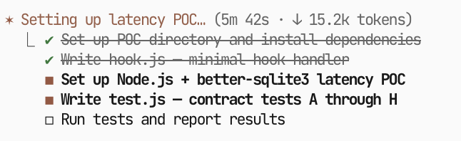
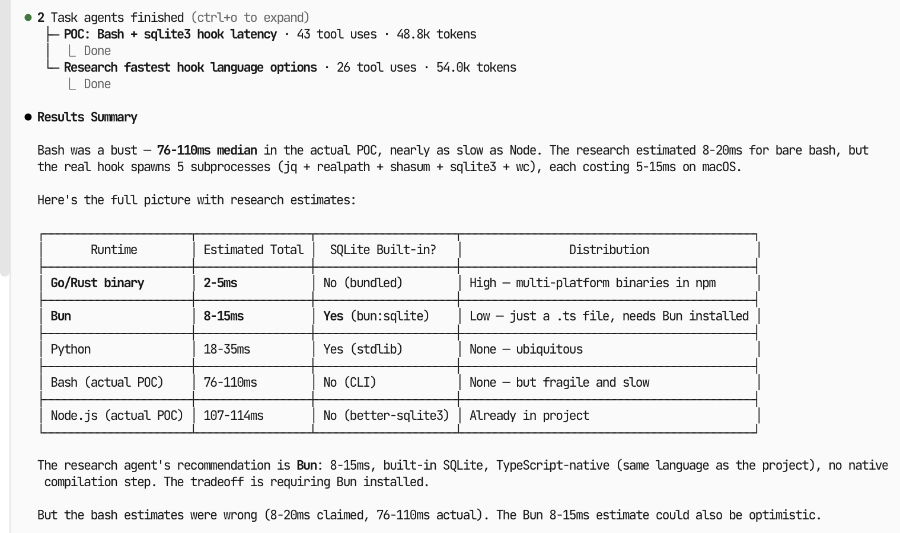

# stress-test-skill

An agent skill that stress-tests technical plans before you build them.

Models are lazy about verification. They'll write a plan that says "use SQLite for concurrent writes" or "Y.js supports persistence out of the box" and move on without checking. These unchecked assumptions become mid-build surprises that force architectural pivots, messy workarounds, and wasted context.

This skill forces the model to actually verify its claims — searching real docs, running proof-of-concept code, and fixing the plan before implementation starts. Each verification runs in a fresh sub-agent context, so there's no confirmation bias from the planning conversation. The result: plans that work on the first try, which means cleaner code with fewer mid-course corrections.

## In action

A plan claimed bash + sqlite3 would be fast enough for git hooks. The skill spun up parallel agents to research alternatives and run an actual latency POC:



The POC disproved the assumption — bash was 4-5x slower than estimated — and surfaced the real tradeoffs across runtimes:



## Install

### Claude Code

```
/plugin marketplace add gbasin/stress-test-skill
/plugin install stress-test
```

Or manually:

```bash
curl -fsSL -o ~/.claude/commands/stress-test.md \
  https://raw.githubusercontent.com/gbasin/stress-test-skill/main/skills/stress-test/SKILL.md
```

### Codex

```
$skill-installer install https://github.com/gbasin/stress-test-skill/tree/main/skills/stress-test
```

Or manually:

```bash
mkdir -p ~/.codex/skills/stress-test
curl -fsSL -o ~/.codex/skills/stress-test/SKILL.md \
  https://raw.githubusercontent.com/gbasin/stress-test-skill/main/skills/stress-test/SKILL.md
```

### Other agent frameworks

Copy `skills/stress-test/SKILL.md` into wherever your framework reads agent instructions from, or include its contents in your agent's system prompt.

## How it works

Six phases, each building on the last:

1. **Decompose** — Extracts every decision, assumption, dependency, and interface from your plan
2. **Verify** — Launches parallel sub-agents to search docs, repos, and the web for evidence. For each claim: *"How do we know this works?"*
3. **Triage** — Separates what's confirmed from what needs hands-on testing. Drafts minimal POC specs for unresolved items.
4. **Approve** — Presents proposed POCs and lets you choose which to run, skip, or modify. Nothing runs without your say-so.
5. **Test** — Runs approved POCs in parallel in an isolated `.poc-stress-test/` directory. Each POC reports confirmed, disproved, or inconclusive with raw output.
6. **Update** — Walks through each finding individually, recommends plan changes, and applies approved updates inline. Cleans up after itself.

## When to use it

- After writing a technical plan or architecture doc, before you start building
- When evaluating a new library, framework, or integration approach
- Before committing to decisions that are expensive to reverse
- Anytime a plan has claims you haven't personally verified

## License

[MIT](LICENSE)
